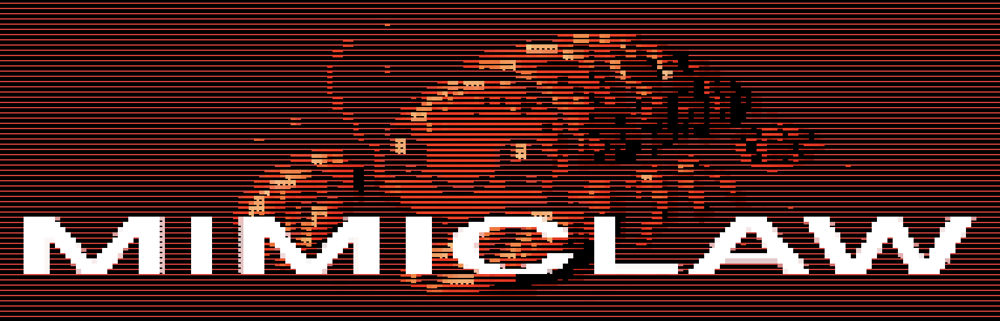
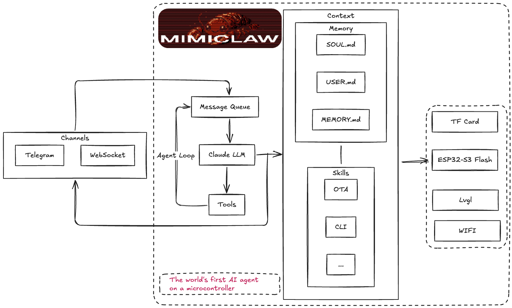

# MimiClaw: $5 芯片上的口袋 AI 助理

<p align="center">
  
</p>

<p align="center">
  <a href="LICENSE"></a>
  <a href="https://deepwiki.com/memovai/mimiclaw"></a>
  <a href="https://discord.gg/r8ZxSvB8Yr"></a>
  <a href="https://x.com/ssslvky"></a>
</p>

<p align="center">
  <strong><a href="README.md">English</a> | <a href="README_CN.md">中文</a> | <a href="README_JA.md">日本語</a></strong>
</p>

**$5 芯片上的 AI 助理（OpenClaw）。没有 Linux，没有 Node.js，纯 C。**

MimiClaw 把一块小小的 ESP32-S3 开发板变成你的私人 AI 助理。插上 USB 供电，连上 WiFi，通过 Telegram 跟它对话 — 它能处理你丢给它的任何任务，还会随时间积累本地记忆不断进化 — 全部跑在一颗拇指大小的芯片上。

## 认识 MimiClaw

- **小巧** — 没有 Linux，没有 Node.js，没有臃肿依赖 — 纯 C
- **好用** — 在 Telegram 发消息，剩下的它来搞定
- **忠诚** — 从记忆中学习，跨重启也不会忘
- **能干** — USB 供电，0.5W，24/7 运行
- **可爱** — 一块 ESP32-S3 开发板，$5，没了

## 工作原理



你在 Telegram 发一条消息，ESP32-S3 通过 WiFi 收到后送进 Agent 循环 — LLM 思考、调用工具、读取记忆 — 再把回复发回来。同时支持 **Anthropic (Claude)** 和 **OpenAI (GPT)** 两种提供商，运行时可切换。一切都跑在一颗 $5 的芯片上，所有数据存在本地 Flash。

## 快速开始

### 你需要

- 一块 **ESP32-S3 开发板**，16MB Flash + 8MB PSRAM（如小智 AI 开发板，~¥30）
- 一根 **USB Type-C 数据线**
- 一个 **Telegram Bot Token** — 在 Telegram 找 [@BotFather](https://t.me/BotFather) 创建
- 一个 **Anthropic API Key** — 从 [console.anthropic.com](https://console.anthropic.com) 获取，或一个 **OpenAI API Key** — 从 [platform.openai.com](https://platform.openai.com) 获取

### 安装

```bash
# 需要先安装 ESP-IDF v5.5+:
# https://docs.espressif.com/projects/esp-idf/en/v5.5.2/esp32s3/get-started/

git clone https://github.com/memovai/mimiclaw.git
cd mimiclaw

idf.py set-target esp32s3
```

<details>
<summary>Ubuntu 安装</summary>

建议基线：

- Ubuntu 22.04/24.04
- Python >= 3.10
- CMake >= 3.16
- Ninja >= 1.10
- Git >= 2.34
- flex >= 2.6
- bison >= 3.8
- gperf >= 3.1
- dfu-util >= 0.11
- `libusb-1.0-0`、`libffi-dev`、`libssl-dev`

Ubuntu 安装与构建：

```bash
sudo apt-get update
sudo apt-get install -y git wget flex bison gperf python3 python3-pip python3-venv \
  cmake ninja-build ccache libffi-dev libssl-dev dfu-util libusb-1.0-0

./scripts/setup_idf_ubuntu.sh
./scripts/build_ubuntu.sh
```

</details>

<details>
<summary>macOS 安装</summary>

建议基线：

- macOS 12/13/14
- Xcode Command Line Tools
- Homebrew
- Python >= 3.10
- CMake >= 3.16
- Ninja >= 1.10
- Git >= 2.34
- flex >= 2.6
- bison >= 3.8
- gperf >= 3.1
- dfu-util >= 0.11
- `libusb`、`libffi`、`openssl`

macOS 安装与构建：

```bash
xcode-select --install
/bin/bash -c "$(curl -fsSL https://raw.githubusercontent.com/Homebrew/install/HEAD/install.sh)"

./scripts/setup_idf_macos.sh
./scripts/build_macos.sh
```

</details>

### 配置

MimiClaw 使用**两层配置**：`mimi_secrets.h` 提供编译时默认值，串口 CLI 可在运行时覆盖。CLI 设置的值存在 NVS Flash 中，优先级高于编译时值。

```bash
cp main/mimi_secrets.h.example main/mimi_secrets.h
```

编辑 `main/mimi_secrets.h`：

```c
#define MIMI_SECRET_WIFI_SSID       "eai-link"
#define MIMI_SECRET_WIFI_PASS       "kxy@0371"
#define MIMI_SECRET_TG_TOKEN        "123456:ABC-DEF1234ghIkl-zyx57W2v1u123ew11"
#define MIMI_SECRET_API_KEY         "sk-ant-api03-xxxxx"
#define MIMI_SECRET_MODEL_PROVIDER  "anthropic"     // "anthropic" 或 "openai"
#define MIMI_SECRET_SEARCH_KEY      ""              // 可选：Brave Search API key
#define MIMI_SECRET_PROXY_HOST      "192.168.1.83 "      // 可选：代理地址
#define MIMI_SECRET_PROXY_PORT      "7897"           // 可选：代理端口
```

然后编译烧录：

```bash
# 完整编译（修改 mimi_secrets.h 后必须 fullclean）
idf.py fullclean && idf.py build

# 查找串口
ls /dev/cu.usb*          # macOS
ls /dev/ttyACM*          # Linux

# 烧录并监控（将 PORT 替换为你的串口）
# USB 转接器：大概率是 /dev/cu.usbmodem11401（macOS）或 /dev/ttyACM0（Linux）
idf.py -p PORT flash monitor
```

> **注意：请插对 USB 口！** 大多数 ESP32-S3 开发板有两个 Type-C 接口，必须插标有 **USB** 的那个口（原生 USB Serial/JTAG），**不要**插标有 **COM** 的口（外部 UART 桥接）。插错口会导致烧录/监控失败。
>
> <details>
> <summary>查看参考图片</summary>
>
> 
>
> </details>

### 代理配置（国内用户）

在国内需要代理才能访问 Telegram 和 Anthropic API。MimiClaw 内置 HTTP CONNECT 隧道支持。

**前提**：局域网内有一个支持 HTTP CONNECT 的代理（Clash Verge、V2Ray 等），并开启了「允许局域网连接」。

可以在 `mimi_secrets.h` 中编译时设置，也可以通过串口 CLI 随时修改：

```
mimi> set_proxy 192.168.1.83 7897   # 设置代理
mimi> clear_proxy                    # 清除代理
```

> **提示**：确保 ESP32-S3 和代理机器在同一局域网。Clash Verge 在「设置 → 允许局域网」中开启。

### 国内大模型支持 (Moonshot / DeepSeek / Doubao)

MimiClaw 完美支持兼容 OpenAI 接口的国内大模型。无需修改代码，只需通过串口命令配置 `api_url` 和 `model` 即可。

**以 Kimi (Moonshot AI) 为例：**

1. 注册 Moonshot 开放平台，获取 API Key。
2. 连接串口，输入以下命令：

```bash
mimi> set_model_provider openai                   # 切换到 OpenAI 兼容模式
mimi> set_api_url https://api.moonshot.cn/v1/chat/completions  # 设置 API 端点
mimi> set_api_key sk-xxxxxxxxxxxxxxxxxxxxxxxx     # 设置你的 API Key
mimi> set_model moonshot-v1-8k                    # 设置模型名称
mimi> restart                                     # 重启生效
```

**以 DeepSeek 为例：**

```bash
mimi> set_model_provider openai
mimi> set_api_url https://api.deepseek.com/chat/completions
mimi> set_api_key sk-xxxxxxxxxxxxxxxxxxxxxxxx
mimi> set_model deepseek-chat
mimi> restart
```

> **注意**：`set_api_url` 必须包含完整的路径（通常以 `/v1/chat/completions` 结尾）。

### CLI 命令

通过串口连接即可配置和调试。**配置命令**让你无需重新编译就能修改设置 — 随时随地插上 USB 线就能改。

**运行时配置**（存入 NVS，覆盖编译时默认值）：

```bash
mimi> wifi_set MySSID MyPassword   # 换 WiFi
mimi> set_tg_token 123456:ABC...   # 换 Telegram Bot Token
mimi> set_api_key sk-ant-api03-... # 换 API Key（Anthropic 或 OpenAI）
mimi> set_api_url https://...        # 设置自定义 API 端点 (用于兼容 OpenAI 的服务)
mimi> set_model_provider openai    # 切换提供商（anthropic|openai）
mimi> set_model gpt-4o             # 换模型
mimi> set_proxy 192.168.1.83 7897  # 设置代理
mimi> clear_proxy                  # 清除代理
mimi> set_search_key BSA...        # 设置 Brave Search API Key
mimi> config_show                  # 查看所有配置（脱敏显示）
mimi> config_reset                 # 清除 NVS，恢复编译时默认值
```

**调试与运维：**

```bash
mimi> wifi_status              # 连上了吗？
mimi> memory_read              # 看看它记住了什么
mimi> memory_write "内容"       # 写入 MEMORY.md
mimi> heap_info                # 还剩多少内存？
mimi> session_list             # 列出所有会话
mimi> session_clear 12345      # 删除一个会话
mimi> heartbeat_trigger           # 手动触发一次心跳检查
mimi> cron_start                  # 立即启动 cron 调度器
mimi> restart                     # 重启
```

## 接入指南

### Telegram 接入

MimiClaw 核心支持 Telegram Bot，配置非常简单。

1. **创建机器人**
   - 在 Telegram 中搜索 [@BotFather](https://t.me/BotFather) 并开始对话。
   - 发送 `/newbot` 命令。
   - 按照提示设置机器人的名称（Name）和用户名（Username）。
   - 成功后，BotFather 会给你一个 **HTTP API Token**，格式如 `123456789:ABCdefGhIJKlmNoPQRstuVWxyz`。

2. **配置 Token**
   - **方法一（推荐）：通过串口动态配置**
     连接开发板串口，输入以下命令：
     ```bash
     mimi> set_tg_token 123456789:ABCdefGhIJKlmNoPQRstuVWxyz
     mimi> restart
     ```
   - **方法二：编译时配置**
     修改 `main/mimi_secrets.h` 文件：
     ```c
     #define MIMI_SECRET_TG_TOKEN "123456789:ABCdefGhIJKlmNoPQRstuVWxyz"
     ```
     然后重新编译烧录：`idf.py fullclean && idf.py build flash monitor`

3. **网络设置（国内用户）**
   - 如果你的网络环境无法直接访问 Telegram API，请配置代理：
     ```bash
     mimi> set_proxy 192.168.1.x 7890  # 替换为你电脑/路由器的局域网 IP 和代理端口
     mimi> restart
     ```

### 飞书 (Feishu) 接入

**⚠️ 当前状态：实验性支持**

MimiClaw 现在支持飞书机器人（企业自建应用），通过 WebSocket 接收消息，无需公网 IP。

1. **创建应用**
   - 登录 [飞书开放平台](https://open.feishu.cn/app) 创建“企业自建应用”。
   - 在“添加应用能力”中启用“机器人”。

2. **配置权限**
   - 进入“权限管理”，搜索并开通以下权限：
     - `im:message` (获取用户发给机器人的单聊消息)
     - `im:message:group_at_msg` (获取群聊中 @机器人的消息)
     - `im:message:send_as_bot` (以应用身份发送消息)
   - 发布版本以生效权限。

3. **开启 WebSocket**
   - 进入“事件订阅”，**不要**配置请求网址。
   - 找到“长连接模式（WebSocket）”并点击开启。
   - 订阅事件：`im.message.receive_v1` (接收消息)。

4. **配置 MimiClaw**
   - 获取 App ID 和 App Secret（在“凭证与基础信息”页）。
   - 连接串口，输入命令：
     ```bash
     mimi> set_feishu_config cli_a1b2c3d4e5f6 secret_1234567890abcdef
     mimi> restart
     ```

现在，你可以给飞书机器人发送消息，MimiClaw 会通过 WebSocket 收到并回复。

## 记忆

MimiClaw 把所有数据存为纯文本文件，可以直接读取和编辑：

| 文件 | 说明 |
|------|------|
| `SOUL.md` | 机器人的人设 — 编辑它来改变行为方式 |
| `USER.md` | 关于你的信息 — 姓名、偏好、语言 |
| `MEMORY.md` | 长期记忆 — 它应该一直记住的事 |
| `HEARTBEAT.md` | 待办清单 — 机器人定期检查并自主执行 |
| `cron.json` | 定时任务 — AI 创建的周期性或一次性任务 |
| `2026-02-05.md` | 每日笔记 — 今天发生了什么 |
| `tg_12345.jsonl` | 聊天记录 — 你和它的对话 |

## 工具

MimiClaw 同时支持 Anthropic 和 OpenAI 的工具调用 — LLM 在对话中可以调用工具，循环执行直到任务完成（ReAct 模式）。

| 工具 | 说明 |
|------|------|
| `web_search` | 通过 Brave Search API 搜索网页，获取实时信息 |
| `get_current_time` | 通过 HTTP 获取当前日期和时间，并设置系统时钟 |
| `cron_add` | 创建定时或一次性任务（LLM 自主创建 cron 任务） |
| `cron_list` | 列出所有已调度的 cron 任务 |
| `cron_remove` | 按 ID 删除 cron 任务 |

启用网页搜索需要在 `mimi_secrets.h` 中设置 [Brave Search API key](https://brave.com/search/api/)（`MIMI_SECRET_SEARCH_KEY`）。

## 定时任务（Cron）

MimiClaw 内置 cron 调度器，让 AI 可以自主安排任务。LLM 可以通过 `cron_add` 工具创建周期性任务（"每 N 秒"）或一次性任务（"在某个时间戳"）。任务触发时，消息会注入到 Agent 循环 — AI 自动醒来、处理任务并回复。

任务持久化存储在 SPIFFS（`cron.json`），重启后不会丢失。典型用途：每日总结、定时提醒、定期巡检。

## 心跳（Heartbeat）

心跳服务会定期读取 SPIFFS 上的 `HEARTBEAT.md`，检查是否有待办事项。如果发现未完成的条目（非空行、非标题、非已勾选的 `- [x]`），就会向 Agent 循环发送提示，让 AI 自主处理。

这让 MimiClaw 变成一个主动型助理 — 把任务写入 `HEARTBEAT.md`，机器人会在下一次心跳周期自动拾取执行（默认每 30 分钟）。

## 其他功能

- **WebSocket 网关** — 端口 18789，局域网内用任意 WebSocket 客户端连接
- **OTA 更新** — WiFi 远程刷固件，无需 USB
- **双核** — 网络 I/O 和 AI 处理分别跑在不同 CPU 核心
- **HTTP 代理** — CONNECT 隧道，适配受限网络
- **多提供商** — 同时支持 Anthropic (Claude) 和 OpenAI (GPT)，运行时可切换
- **定时任务** — AI 可自主创建周期性和一次性任务，重启后持久保存
- **心跳服务** — 定期检查任务文件，驱动 AI 自主执行
- **工具调用** — ReAct Agent 循环，两种提供商均支持工具调用

## 开发者

技术细节在 `docs/` 文件夹：

- **[docs/ARCHITECTURE.md](docs/ARCHITECTURE.md)** — 系统设计、模块划分、任务布局、内存分配、协议、Flash 分区
- **[docs/TODO.md](docs/TODO.md)** — 功能差距和路线图

## 贡献

提交 Issue 或 Pull Request 前，请先阅读 **[CONTRIBUTING.md](CONTRIBUTING.md)**。

## 许可证

MIT

## 致谢

灵感来自 [OpenClaw](https://github.com/openclaw/openclaw) 和 [Nanobot](https://github.com/HKUDS/nanobot)。MimiClaw 为嵌入式硬件重新实现了核心 AI Agent 架构 — 没有 Linux，没有服务器，只有一颗 $5 的芯片。

## Star History

[](https://star-history.com/#memovai/mimiclaw&Date)
